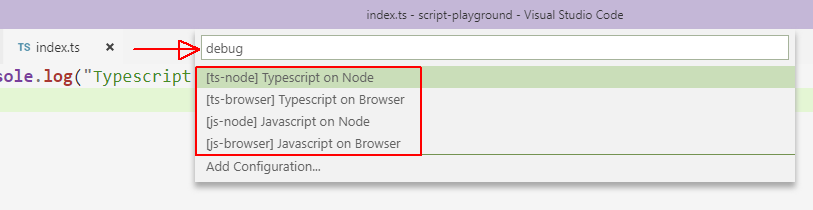
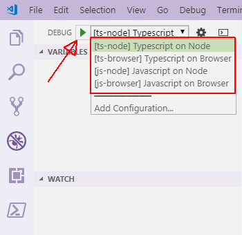

# Script playground
The script-playground is a Visual Studio Code-based playground for JavaScript and Typescript in Node and browser environments.

It allows you to run and debug scripts in any of the above-mentioned language and environment combinations.

## Getting started
1. [Fork](https://help.github.com/articles/fork-a-repo/) this repository to your own GitHub account.

    > **Note**: You do not need to fork the repository. You can clone this original repository or just download the source to your system. However, there are additional benefits if you fork the repository.

2. Clone the forked repository to a folder on your system.
    ```sh
    # Clone from forked repository
    git clone https://github.com/your_account/script-playground.git

    # Or clone from original repository
    git clone https://github.com/JeevanJames/script-playground.git
    ```

3. From the cloned folder, install project dependencies
    ```sh
    npm install
    ```

4. Open the folder in Visual Studio Code
    ```sh
    code .
    ```

## Using the playground
You're now ready to run and debug Typescript and JavaScript snippets from VS Code.

The project contains 4 root-level folders. Depending on the language and environment you want to debug, you can start modifying the `index` file in the appropriate folder:
- `js-browser`: Run JavaScript in the default browser.
- `js-node`: Run JavaScript in Node.
- `ts-browser`: Compile Typescript to JavaScript and run in the default browser.
- `ts-node`: Compile Typescript to JavaScript and run in Node.

Update the `index.js` or `index.ts` file in the required folder. You can set breakpoints in VS Code.

To select the launch configuration to run or debug the code, do any of the following:
1. Open the Command Palette (`Ctrl+P`), and type `'debug '` (debug followed by a space) to see the list of launch configurations. Choose one to start.

    

2. Open the Debug pane (`Ctrl+Shift+D`) and select the launch configuration from the top. Click on the green `Start Debugging` button to start.

    

If the correct launch configuration is already selected, there are additional ways to run or debug the code:
1. Press `F5`

2. Select `Start Debugging` from the `Debug` menu.

Use the VS Code debugging commands to step through the code, add watches and view stack traces.

You can stop debugging at any time by selecting `Stop Debugging` from the `Debug` menu (`Shift+F5`).

## Using Git branches to manage code
Instead of directly editing code in the `master` branch, you can create local Git branches for each coding session. This will allow you to have multiple script playgrounds to test different code, effectively making each branch a saved file.

```sh
git checkout -b [name-of-your-new-branch]
```

If you have forked the repository to your own GitHub account, you can also push the branch to the server. This will allow you to work on the code from multiple machines.

```sh
git push origin [name-of-your-new-branch]
```

List all available branches with the following command:

```sh
git branch
```
